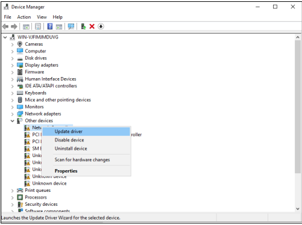
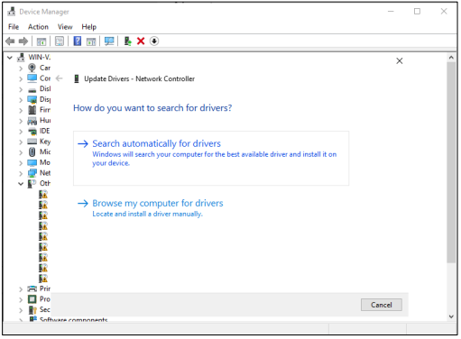
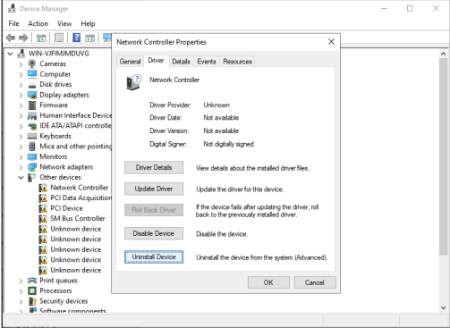
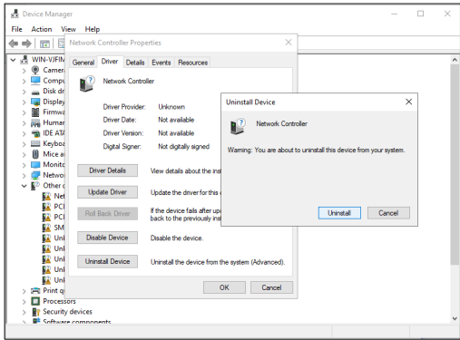

# Practical No. 2: Install Device Drivers

## a) Install and Configure Hardware Device Drivers

Step 1 — Right-click Start → Click Device Manager

Step 2 — Identify Devices Needing Drivers

Step 3 — For Automatic Installation:
- Right-click the device → Update Driver
- Choose "Search automatically for drivers"
- Windows checks Windows Update or preloaded drivers

For Manual Installation:
- Download the latest driver from the vendor website
- Right-click the device → Update Driver → Browse my computer for drivers
- Select the downloaded driver folder → Install

Step 4 — To Configure the Driver:
- Right-click the device → Click Properties
- Configure settings under tabs: Driver (update, roll back, disable), Power Management, Advanced (device-specific settings)

Step 5 — Restart the Server (if needed)

---

## b) Uninstall Device Drivers

Step 1 — Right-click Start → Select Device Manager

Step 2 — Locate the Device

Step 3 — Open Device Properties:
- Right-click the device
- Click Properties

Step 4 — In the Properties window → click Driver tab → Click Uninstall

Step 5 — Restart the Server
